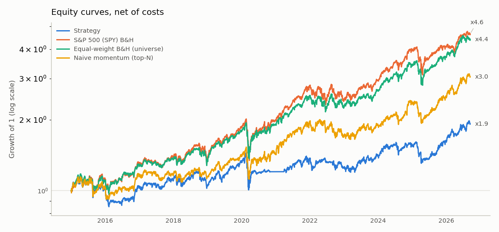
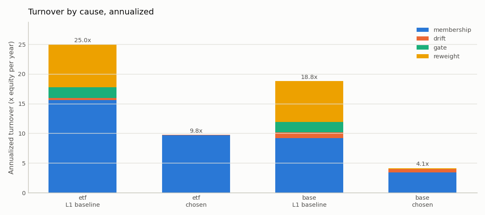

# thematic-alpha

A macro-gated momentum **strategy research engine**, now with a point-in-time control universe.
It formalizes a discretionary, macro-gated momentum process into a reproducible, testable
system: data layer with a cross-exchange calendar and FX decomposition, a point-in-time feature
panel, a rules-based strategy (macro gate, momentum ranker with a rank buffer, earnings mask,
sizing limits, a position no-trade band), a custom cost-aware backtester with turnover
attribution, a risk module, a generated report per run, and a study runner that reruns the
whole thing as an ablation on two universes.

**What it found (brief v2, data through 2026-09-11).** Same rules, same window, same costs:
**39.8% CAGR with the hindsight-selected 12-stock universe, 5.7% without** (17 sector,
thematic and defensive ETFs defined point-in-time). Equal-weight buy-and-hold shows the same
gap with no rules at all (40.4% vs 13.5%), so the Layer 1 return was the universe, not the
rules. On the ETF universe the rules lose to holding the basket on every headline metric
(Sharpe 0.30 vs 0.71). Full numbers and the ablation: [`outputs/study.md`](outputs/study.md).

> **This is a research and analysis system, not a live trading system.** It never places
> orders, integrates with a broker, or paper-trades. Historical results do not indicate future
> performance. Nothing here is investment advice.

## Headline: the point-in-time ETF universe (net of costs, EUR, 2015-01-02 → 2026-09-11)



| | Strategy (chosen rules) | S&P 500 (SPY) B&H | **Equal-weight B&H (same 17 ETFs)** | Naive momentum |
|---|---:|---:|---:|---:|
| CAGR | 5.7% | 14.1% | **13.5%** | 10.0% |
| Sharpe (excess over 3m T-bill) | 0.30 | 0.69 | **0.71** | 0.52 |
| Max drawdown | −30.5% | −33.5% | **−29.9%** | −27.0% |
| Annualized turnover | 9.8× | 0.1× | 0.2× | 23.0× |
| Costs (% of final equity) | 5.95% | 0.02% | 0.05% | 11.17% |

The column to read the strategy against is the equal-weight buy-and-hold: it holds the same
names and isolates what the rules add. They subtract. Per-run detail (VaR, drawdown episodes,
FX decomposition, universe composition table): [`outputs/etf/report.md`](outputs/etf/report.md).

**Selection bias, measured.** The 12-stock run of Layer 1 is kept as the control that measures
the cost of hindsight selection:

| Chosen rules | 12 stocks (hindsight) | 17 ETFs (point-in-time) | difference |
|---|---:|---:|---:|
| Strategy CAGR | 39.8% | 5.7% | 34.1%/yr |
| Strategy Sharpe | 1.13 | 0.30 | 0.83 |
| Equal-weight B&H CAGR | 40.4% | 13.5% | 26.9%/yr |
| Equal-weight B&H Sharpe | 1.19 | 0.71 | 0.47 |

Control detail: [`outputs/base/report.md`](outputs/base/report.md).

## Limitations (read these first)

1. **Residual selection bias in the ETF universe.** The 17 ETFs were chosen by category, not
   by past performance, and every name enters the cross-section only when it has 252 sessions
   of history and clears a liquidity screen, so the investable set is point-in-time. But the
   list contains only funds that still trade in 2026; funds in these categories that were
   liquidated or merged away are absent (ETF-delisting bias). This flatters the ETF basket
   modestly. It is far smaller than hindsight stock selection, but it is not zero.
2. **Hindsight bias in the stock control is the dominant effect there.** The twelve names were
   chosen in 2026 knowing they had been the AI-infrastructure winners; the control's absolute
   returns are an upper bound on a lucky basket and are used only relative to their own
   equal-weight buy-and-hold and against the ETF run.
3. **The block-mode gate emptied the book in 2020–21.** After the COVID crash the ranker exited
   names as ranks rotated, the VIX stayed above the 20-point release level for a year, and the
   gate blocked every re-entry: the ETF book was 6–20% invested from Q3 2020 to Q1 2021 and
   missed most of the recovery. With the gate disabled the ETF strategy makes 9.9% instead of
   5.7%. On the stock control the gate is neutral (Sharpe 1.13 either way). This is the price
   of an asymmetric rule (exits allowed, entries blocked) in a long risk-off regime.
4. **The liquidity screen changes the control's benchmark.** At 5 M EUR of 21-day traded value
   the screen toggles COHR and IREN in and out of the stock universe; the equal-weight
   buy-and-hold re-equalizes on every eligibility change, which moves it from 43.6% to 40.4%
   CAGR. The screen-off row of the ablation shows the effect; it was not changed after the run.
5. **Short window, one dominant regime.** Eleven years that were mostly a secular bull market,
   with three drawdowns (2018, 2020, 2022). Sharpe ratios on a concentrated long-only basket
   are a regime statement, not a strategy statement.
6. **Unhedged FX.** Base currency is EUR; positions are USD (and KRW in the control). The FX
   contribution is reported separately in each report.
7. **Survivorship in benchmarks.** Index ETFs are survivorship-biased by construction.
8. **Macro data is current-vintage.** FRED series are revised; the one-session publication lag
   is the only point-in-time control. ALFRED vintages are a later item.
9. **Earnings dates** (control only) come from yfinance and are reviewed by hand; a ticker
   with none fails open. The ETF run has the mask disabled: ETFs report no earnings.
10. **Benchmark change vs Layer 1.** The S&P column is now SPY (dividend-adjusted, 14.1%/yr);
    Layer 1 used ^GSPC, a price-return index (11.8%/yr). Layer 1's strategy numbers were also
    annualized over the NYSE ∪ KRX master calendar; everything is now annualized on NYSE
    sessions, which lifts the control's Layer 1 baseline from 37.1% to 37.5% CAGR.
11. **House-money sizing rule is not implemented**; the flag is off in the ETF config and
    announced-but-ignored in the control.

## Parameter discipline

Every new parameter was **set from standard practice, not optimised**, and written down with
its neutral (Layer 1) value, chosen value and rationale in
[`docs/preregistration_v2.md`](docs/preregistration_v2.md) *before* the runs that use it (the
commit precedes the runs in `git log`). Every neutral default reproduces Layer 1 exactly
(`tests/test_golden.py` against a frozen fixture), the chosen values live only in the YAML
configs, and nothing was changed after seeing a result.

## Turnover: measure first, then control

Layer 1 turned the book over 18.8× a year. Every trade is now attributed to a cause that sums
to the total exactly: **membership** (entries/exits), **drift**, **gate**, **reweight**.



| Universe | Rules | membership | drift | gate | reweight | total | **avg held rank** | costs %eq |
|---|---|---:|---:|---:|---:|---:|---:|---:|
| 17 ETFs | L1 baseline | 15.59 | 0.36 | 1.79 | 7.26 | 25.00 | 3.00 | 14.32% |
| 17 ETFs | chosen | 9.66 | 0.09 | 0.00 | 0.00 | 9.75 | 3.55 | 5.95% |
| 12 stocks | L1 baseline | 9.18 | 0.97 | 1.75 | 6.87 | 18.77 | 3.00 | 2.62% |
| 12 stocks | chosen | 3.40 | 0.60 | 0.00 | 0.14 | 4.14 | 3.82 | 0.58% |

**The held-rank trade-off.** The rank buffer (enter at rank ≤ 5, exit only below rank 8) is the
single knob that cuts turnover most, and it is not free: the average cross-sectional rank of the
held names rises from 3.0 (plain top-5, by construction) to 3.55 on the ETFs and 3.82 on the
stocks. Wherever a turnover reduction is reported, that number sits next to it so the
signal-quality cost is visible rather than hidden in the net figure. In block mode the gate's
own turnover reads 0.00 because a blocked *entry* that later executes is membership turnover;
the gate-disabled row of the ablation is the honest measure of what the gate does.

## Ablation (summary; full table in `outputs/study.md`)

| | 12 stocks: Sharpe / turnover | 17 ETFs: Sharpe / turnover |
|---|---:|---:|
| L1 baseline (tiers, top-5, gate scale/weekly) | 1.07 / 18.8× | 0.34 / 25.0× |
| + equal weight | 1.11 / 16.5× | 0.44 / 23.1× |
| + rank buffer (exit rank 8) | 1.09 / 7.7× | 0.40 / 12.7× |
| + position band 2 pp | 1.08 / 6.7× | 0.40 / 12.0× |
| + gate: block increases | 1.10 / 4.5× | 0.45 / 10.2× |
| + gate: Schmitt trigger | 1.09 / 4.3× | 0.35 / 9.9× |
| + gate: monthly evaluation (= chosen) | 1.13 / 4.1× | 0.30 / 9.8× |
| chosen, gate disabled | 1.13 / 4.6× | 0.50 / 10.7× |
| chosen with softmax τ = 0.5 / 1 / 2 | 0.84 / 0.98 / 1.06 | −0.03 / 0.09 / 0.20 |

**Gate comparability across universes.** TLT and GLD change what the gate is measuring. With
defensive assets in the universe, risk-off rotation can happen through the ranker, with momentum
simply selecting bonds or gold, rather than the gate forcing cash. The two mechanisms partly
substitute for each other, so the gate's measured contribution on the ETF universe is **not
directly comparable** to its contribution on the stock universe, where the gate is the only
risk-off mechanism. The `defensive` segment is exempt from the block rule, which is what lets
that substitution happen while the gate is risk-off.

**Where this sits in the literature.** Cross-sectional momentum on sector ETFs is tactical asset
allocation with published precedent. Faber's "A Quantitative Approach to Tactical Asset
Allocation" applies a monthly trend filter (price vs a 10-month moving average) per asset class
and moves the failing sleeve to cash; Antonacci's dual momentum combines relative strength
across assets with an absolute-momentum filter that moves to bonds, again evaluated monthly;
Moskowitz and Grinblatt (1999) documented momentum at the industry level, which is what a
sector-ETF ranker trades on. The design choices here map onto that tradition: a monthly cadence
for the risk filter, top-N relative strength for selection, and a rank buffer of the kind used
in buffered index rules to cut turnover. Those works describe approaches with monthly, not
weekly, rebalancing and with cash or bonds as the risk-off sleeve; no performance figures from
them are quoted here because none were verified against the sources for this window.

## Methodology

The chosen rules, every parameter of which lives in [`configs/etf.yaml`](configs/etf.yaml)
(ETF universe) and [`configs/base.yaml`](configs/base.yaml) (12-stock control; identical except
for the universe, the benchmark list, the report framing and the mask/house-money flags):

| Component | Rule |
|---|---|
| Universe | ETF: 11 sector, 4 thematic, 2 defensive ETFs (`data/reference/universe_etf.csv`); control: 12 AI-infrastructure names (`data/reference/universe.csv`). SPY is `benchmarks[0]` in both |
| Eligibility | 252 observed sessions and a 21-day average traded value ≥ 5 M EUR (no imputation). XLRE enters 2016-10-06, XLC 2019-06-19 |
| Ranker | Cross-sectional z-score of 63-day momentum (skipping 5 days), **equal weight** over the held set; **rank buffer**: enter at rank ≤ 5 into a vacant slot, stay while rank ≤ 8, never more than 5 names |
| Macro gate | Sub-gates on lagged VIX (engage > 25, release ≤ 20), 21-day 10y-yield change (+40 / +32 bp) and 21-day WTI change (+20% / +16%): **Schmitt triggers**, evaluated **monthly** and held between evaluations. Any engaged sub-gate = risk-off: **block increases** (no new entries, no increases for non-exempt names, exits and decreases follow the ranker, blocked weight stays in cash); `defensive` names are exempt |
| Earnings mask | Control only: no *increase* within 3 sessions before a known earnings date; disabled on ETFs |
| Sizing | 35% per-name cap (excess to cash), 0% cash floor |
| Position band | In the engine: a held→held trade is skipped when the target is within 2 pp of the *drifted* weight; exits and entries always trade; strategy runs only |
| Schedule | Signal on the last NYSE session of each week on or before Friday; executed the next session at the open |
| Costs | 5 bp per side + 3 bp slippage on traded notional, paid from cash; buys are sized so cash never goes negative |
| Benchmarks | SPY buy-and-hold; equal-weight buy-and-hold of the universe (re-equalized when the eligible set changes); naive equal-weight top-5 momentum with no gate or mask; all through the same engine and cost model, none with the band |

**Point-in-time discipline.** Every feature at date *t* uses data through the close of *t*;
the rank buffer, the Schmitt triggers and the monthly gate are pure functions of history.
`tests/test_no_lookahead.py` asserts (a) shifting all inputs by one day moves the outputs with
them, (b) deleting all data after *t* leaves every feature at or before *t* unchanged, (c) a
synthetic future price spike leaves no trace before it, (d) a price shock after *t + 1* cannot
alter the trade produced by a signal at *t*, and (e) deleting the future leaves every target
weight, held-rank value and trade at or before *t* unchanged, with the neutral and the chosen
settings.

**Lesson from Layer 1.** Two bugs lived in data artifacts rather than code: a wrong row in the
universe CSV, and an empty earnings CSV that made the mask fail open everywhere while every test
stayed green. Tests see code; they do not see the files the code reads. That is why the
eligibility table, the mask counts and the gate counts are printed by every run and the
earnings file is reviewed by hand.

## Known data problems and how they are handled

| Problem | Handling |
|---|---|
| Hindsight / selection bias | Point-in-time ETF universe as the headline; the 12-stock run kept as the control that measures it; equal-weight buy-and-hold of the same basket reported everywhere |
| ETF-delisting bias | Stated; not corrected (no delisted-fund data) |
| Short histories (NBIS, IREN, XLRE, XLC) | No imputation. A name is excluded until it has 252 sessions; the composition table and figure show when each name enters |
| Illiquid periods (ITA, IGV in 2015–16; COHR, IREN) | Liquidity screen on 21-day traded value; the screen's effect is an ablation row |
| Two calendars (control) | `exchange_calendars` sessions; master calendar = NYSE ∪ KRX; features on own sessions; metrics annualized on NYSE sessions |
| SK Hynix adjusted close negative through 2002 | `regime_start_date = 2003-01-02` truncates it |
| FRED gaps and revisions | Forward-fill only, never back-fill; one-session publication lag; current vintage, stated |
| WTI negative print (2020-04-20) | The 21-day change floors its *denominator* at $1 |
| Earnings dates (control) | Seeded from yfinance, reviewed by hand, version-controlled; missing tickers fail open with a warning |
| Gate chattering | Measured (88 transitions, 27 reversed within a week on the control at Layer 1), then removed at the source by the Schmitt triggers and monthly evaluation (34 transitions, 0 reversed) |

## Build status

| Layer | Status |
|---|---|
| 0 — Foundation (config, price cache, CLI, tests) | done |
| 1 — Data, features, strategy, engine, risk, report (12-stock control) | done |
| 2.0 — Report determinism, golden fixture, SPY benchmark, preregistration | done |
| 2.1 — Turnover attribution and gate diagnostics | done |
| 2.2–2.5 — Softmax weighting, rank buffer, position band, gate redesign (block / Schmitt / monthly) | done |
| 2.6 — Point-in-time ETF universe, liquidity screen, per-run outputs | done |
| 2.7 — Study runner: control rerun + ablation, `outputs/study.md` | done |
| Next — §13 case study (2026 YTD vs the real trade log), point-in-time *stock* universe (§15), house-money simulator | not started |
| Later — Factor attribution, Monte Carlo, ML ranker, dashboard, ALFRED vintages, CI | not started |

## Reproduction

Requires Python 3.11+ and network access for the first run (yfinance + FRED; everything is
cached to Parquet under `data/cache/`). Both configs pin `run.end_date` to the 2026-09-11
snapshot; `--refresh` re-downloads and a later `end_date` extends the window.

```bash
git clone <this repo> && cd thematic_alpha_model
python3.12 -m venv .venv && source .venv/bin/activate
pip install -r requirements.txt && pip install -e .

# One run: data -> features -> strategy -> backtests -> attribution -> risk -> report
python -m thematic_alpha.run --config configs/etf.yaml     # -> outputs/etf/
python -m thematic_alpha.run --config configs/base.yaml    # -> outputs/base/ (control)

# The study: both universes, L1 baseline + cumulative + one-at-a-time + sensitivity + references
python -m thematic_alpha.study --configs configs/etf.yaml configs/base.yaml   # -> outputs/study.md

# Offline test suite (no network; golden regression, no-lookahead, every knob)
pytest
ruff check . && black --check .
```

Outputs per run under `outputs/<run.name>/`: `report.md`, `data_quality.md`, `figures/*.png`,
`target_weights.csv`, `turnover_attribution.csv`, `held_rank.csv`, `feature_panel.parquet`.
The study writes `outputs/study.md` and `outputs/study/` (ablation CSVs, figures). Reports are
deterministic: a rerun on the same data is byte-identical.

To refresh earnings dates (control): `python scripts/seed_earnings_dates.py`, then review the
printed spot-check list before committing `data/reference/earnings_dates.csv`. To re-freeze the
golden fixture (only when Layer 1 behaviour is deliberately redefined):
`python scripts/freeze_golden.py`.

## Layout

```
configs/etf.yaml, base.yaml      every tunable; chosen values (neutral defaults live in config.py)
docs/preregistration_v2.md       neutral / chosen value and rationale per knob, committed before the runs
data/reference/                  universe_etf.csv, universe.csv, earnings_dates.csv
data/cache/                      Parquet cache (gitignored)
src/thematic_alpha/
  config.py                      pydantic v2 schema; every new knob defaults to Layer 1
  data/        prices, macro (FRED CSV endpoint), calendar, fx, universe, quality, cache
  features/    price_features, macro_features, build (eligibility incl. liquidity, first dates)
  strategy/    macro_gate (Schmitt, cadence, block), ranker (softmax, rank buffer), event_mask,
               sizing, compose (p / q / w books)
  backtest/    schedule, engine (position band, trade log), attribution, costs, benchmarks
  risk/        metrics (market-calendar annualization), drawdown
  reporting/   plots, tables, report
  pipeline.py                    one function per stage
  run.py                         CLI for one run
  study.py                       CLI for the ablation study
scripts/                         seed_earnings_dates.py, freeze_golden.py
tests/                           offline; synthetic markets in tests/synthetic.py, golden fixture in tests/fixtures/
outputs/                         <run>/report.md + figures (committed), study.md, study/
```

## Disclaimer

This project is a research and educational exercise in quantitative strategy design,
backtesting methodology, and validation. It does not execute trades, does not constitute
investment advice, and its historical results do not indicate future performance. The stock
control was selected with hindsight and its results are correspondingly biased upward; the ETF
universe carries a residual delisting bias.
