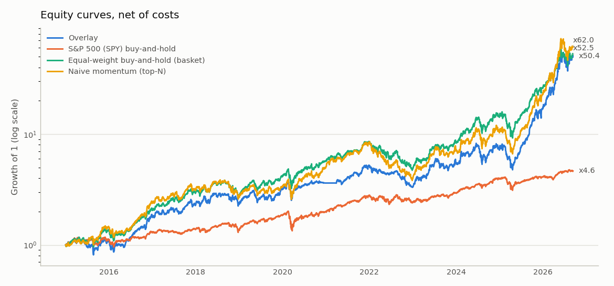
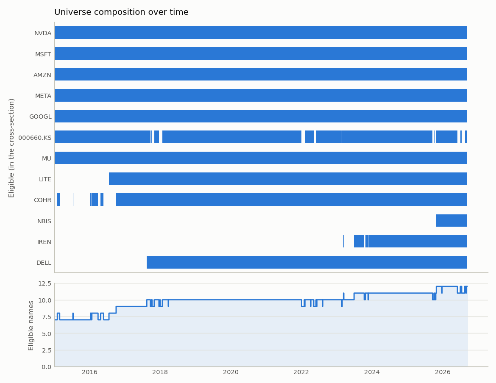
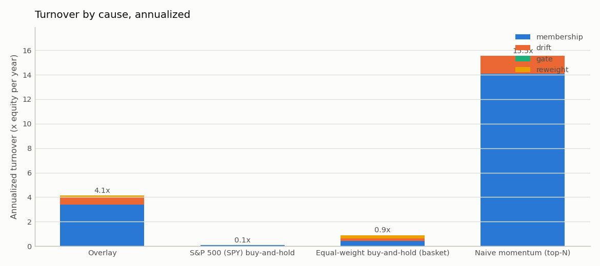
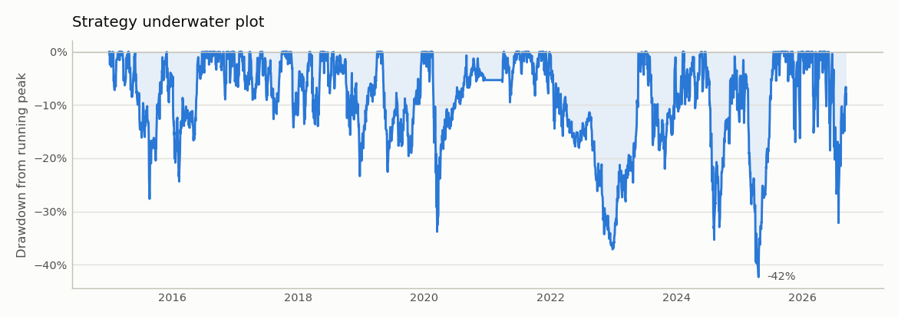
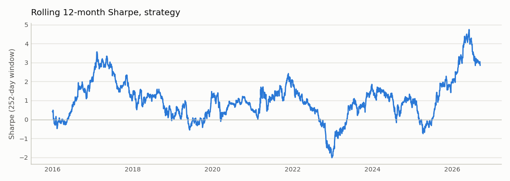
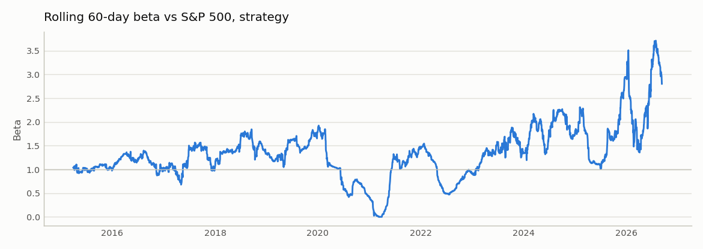
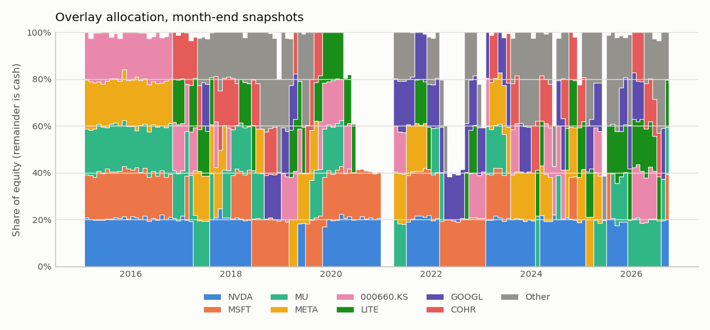
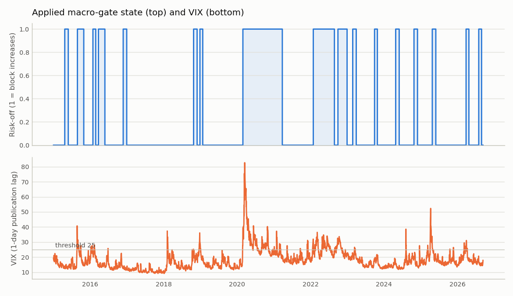

# Does an active macro overlay beat holding the basket? — run `base`

*A personal research study on the author's 12-stock AI / datacenter basket, 2015-2026*

**Thesis.** A high-beta AI / datacenter basket is most exposed to macro stress: equity-volatility spikes (VIX), sharp rises in the 10-year yield and oil shocks compress the multiples of long-duration growth names first. The overlay ranks the basket on 3-month momentum, holds the top five, and stops adding risk while any of the three macro triggers is engaged. The prediction under test is that the overlay preserves most of the basket's upside while cutting its drawdowns in stress regimes; if it does not, buy-and-hold is the better policy.

**What is being tested.** The 12 names in `data/reference/universe.csv` are the author's own holdings. The basket is a given, not a selection result, so the question is not whether these names were a good pick but whether an active, macro-aware overlay beats simply holding them. Equal-weight buy-and-hold of the same basket is therefore the only benchmark that matters, and every overlay figure below is read against that column. Absolute returns carry the basket's own selection and say nothing about the rules; the S&P 500 appears in the appendix as context only.

> Research system, not a trading system. Nothing here is investment advice. All figures are net of transaction costs.

## Verdict

Over 2015-01-01 → 2026-09-11 (140 months) the overlay's CAGR is lower than equal-weight buy-and-hold of the same basket (39.9% vs 40.4%), its Sharpe is lower (1.13 vs 1.19), and its maximum drawdown is shallower (-42.3% vs -45.0%). Realised beta to the S&P 500 is 1.17 for the overlay and 1.30 for buy-and-hold. **The overlay is roughly break-even to modestly value-additive on a risk-adjusted basis**: it gives up return relative to holding the basket in exchange for a shallower drawdown, net of costs.

## Headline results (net of costs): overlay vs buy-and-hold of the basket

| Metric | Overlay | Equal-weight buy-and-hold (basket) |
|---|---:|---:|
| Total return | 4942.4% | 5149.2% |
| CAGR | 39.9% | 40.4% |
| Annualized volatility | 32.7% | 30.9% |
| Sharpe (excess over DTB3) | 1.13 | 1.19 |
| Sortino (MAR 0) | 1.67 | 1.72 |
| Max drawdown | -42.3% | -45.0% |
| Max DD peak | 2024-06-18 | 2021-12-27 |
| Max DD trough | 2025-04-21 | 2022-12-28 |
| Max DD recovery | 2025-07-17 | 2023-12-21 |
| Max DD duration (days) | 394 | 724 |
| Calmar | 0.94 | 0.90 |
| Historical VaR 95% (daily) | 3.1% | 3.1% |
| Historical VaR 99% (daily) | 5.5% | 5.3% |
| Parametric VaR 95% (daily) | 3.2% | 3.1% |
| Parametric VaR 99% (daily) | 4.6% | 4.4% |
| CVaR / ES 95% (daily) | 4.8% | 4.5% |
| Excess kurtosis (daily) | 4.70 | 3.95 |
| Hit rate (weekly periods) | 59.9% | 61.4% |
| Average win (weekly period) | 3.5% | 3.4% |
| Average loss (weekly period) | -3.3% | -3.4% |
| Annualized turnover | 4.14 | 0.90 |
| Total costs paid | 2,922.35 | 920.58 |
| Costs as % of final equity | 0.58% | 0.18% |

VaR note: parametric (normal) 99% VaR of the overlay is 4.6% against a historical 5.5%; daily excess kurtosis is 4.70. The normal assumption understates the tail.

## Performance by regime

The overlay is a macro-timing rule, so it is tested where it claims to help. Every session is tagged by the state the gate could see that day and the overlay is compared with equal-weight buy-and-hold inside each bucket: VIX calm below 20, elevated between 20 and 25, stress above 25; gate risk-off / risk-on as applied to the book; rate shock when the 21-day change in the 10-year yield exceeds 40 bp. Total return compounds the bucket's sessions and the worst drawdown is measured on that concatenated path; an annualised return is shown only for buckets with at least 24 months of sessions.

**By VIX regime (lagged level the gate reads)**

| Regime | Run | Share of sessions | Total return | Annualised | Volatility | Hit rate (sessions) | Worst drawdown |
|---|---|---:|---:|---:|---:|---:|---:|
| calm | Overlay | 70.6% | 1033.9% | 34.3% | 31.4% | 54.7% | -39.3% |
| calm | Equal-weight buy-and-hold (basket) | 70.6% | 1039.1% | 34.3% | 26.8% | 55.7% | -33.1% |
| elevated | Overlay | 16.1% | 156.8% | n/a | 32.1% | 61.2% | -18.5% |
| elevated | Equal-weight buy-and-hold (basket) | 16.1% | 77.7% | n/a | 34.0% | 54.6% | -33.7% |
| stress | Overlay | 13.2% | 73.1% | n/a | 39.5% | 55.8% | -27.2% |
| stress | Equal-weight buy-and-hold (basket) | 13.2% | 159.3% | n/a | 44.7% | 55.0% | -26.7% |

**By applied gate state**

| Regime | Run | Share of sessions | Total return | Annualised | Volatility | Hit rate (sessions) | Worst drawdown |
|---|---|---:|---:|---:|---:|---:|---:|
| risk-on | Overlay | 71.7% | 1457.7% | 38.9% | 33.6% | 55.6% | -45.9% |
| risk-on | Equal-weight buy-and-hold (basket) | 71.7% | 1336.0% | 37.5% | 29.3% | 56.4% | -41.8% |
| risk-off | Overlay | 28.3% | 223.7% | 42.7% | 30.2% | 56.7% | -26.3% |
| risk-off | Equal-weight buy-and-hold (basket) | 28.3% | 265.5% | 48.0% | 34.7% | 52.9% | -28.5% |

**By 10-year yield change (rate shock = above the gate's engage threshold)**

| Regime | Run | Share of sessions | Total return | Annualised | Volatility | Hit rate (sessions) | Worst drawdown |
|---|---|---:|---:|---:|---:|---:|---:|
| no shock | Overlay | 94.4% | 5401.5% | 43.9% | 33.0% | 56.2% | -43.0% |
| no shock | Equal-weight buy-and-hold (basket) | 94.4% | 5988.8% | 45.2% | 31.0% | 55.9% | -41.8% |
| rate shock | Overlay | 5.6% | -8.3% | n/a | 26.6% | 51.2% | -20.2% |
| rate shock | Equal-weight buy-and-hold (basket) | 5.6% | -13.8% | n/a | 29.1% | 47.0% | -27.4% |

In the VIX stress regime (13.2% of sessions) the overlay returns 73.1% against 159.3% for buy-and-hold, with a worst drawdown of -27.2% vs -26.7%; while the gate is risk-off (28.3% of sessions) the overlay returns 223.7% against 265.5% for buy-and-hold, with a worst drawdown of -26.3% vs -28.5%; during rate shocks (5.6% of sessions) the overlay returns -8.3% against -13.8% for buy-and-hold, with a worst drawdown of -20.2% vs -27.4%. **The regime evidence is mixed**: the overlay beats holding the basket in 1 of 3 stress buckets.

## Configuration

| Setting | Value |
|---|---|
| Backtest window | 2015-01-01 → 2026-09-11 |
| Universe | `data/reference/universe.csv`, 12 names, selection: owned_portfolio; market: SPY |
| Base currency | EUR |
| Rebalance | weekly, friday |
| Execution | t + 1 session at the open |
| Costs | model=bps, 5 bps/side + 3 bps slippage, flat 1 EUR |
| Idle cash | earns DTB3 (calendar-day accrual), all runs |
| Ranker | momentum_zscore, top 5 (exit rank 8), equal |
| Macro gate | block increases while any sub-gate is engaged (VIX>25 (release 20); 10y +40bp (release 32bp)/21d; WTI +20% (release 16%)/21d); exempt segments: defensive; scale factors and floor unused; evaluated monthly |
| Event mask | block new exposure 3 sessions before earnings (on) |
| Sizing | max weight 0.35, cash floor 0 |
| Liquidity screen | 21-day average traded value ≥ 5,000,000 EUR |
| Turnover control | position no-trade band 2 pp (on; overlay only) |
| Min history | 252 sessions |
| Macro publication lag | 1 session |

## Data quality

15 price series and 11 FRED series loaded; 38 single-day moves above 25% flagged for manual review. Full per-ticker table: `data_quality.md` next to this report. Known handling: SK Hynix truncated to 2003 (mis-adjusted 2002 reverse split in the source), zero-volume bars on Korean holidays dropped, master calendar = NYSE ∪ KRX sessions with forward-fill only across a name's own holidays.

## Universe composition

When each name enters the cross-section (backtest starts 2015-01-02; a date before that means the name was eligible from the first signal date). Liquidity-eligible is the first date the 21-day average traded value clears the screen.

| Ticker | First price | History-eligible | Liquidity-eligible | First eligible | Enters |
|---|---|---|---|---|---|
| NVDA | 1999-01-22 | 2000-01-20 | 1999-02-22 | 2000-01-20 | from start |
| MSFT | 1998-01-02 | 1998-12-31 | 1999-02-02 | 1999-02-02 | from start |
| AMZN | 1998-01-02 | 1998-12-31 | 1999-02-02 | 1999-02-02 | from start |
| META | 2012-05-18 | 2013-05-21 | 2012-06-18 | 2013-05-21 | from start |
| GOOGL | 2004-08-19 | 2005-08-17 | 2004-09-17 | 2005-08-17 | from start |
| 000660.KS | 2003-01-02 | 2004-01-08 | 2003-01-30 | 2004-01-08 | from start |
| MU | 1998-01-02 | 1998-12-31 | 1999-02-02 | 1999-02-02 | from start |
| LITE | 2015-07-23 | 2016-07-21 | 2015-08-20 | 2016-07-21 | mid-window |
| COHR | 1998-01-02 | 1998-12-31 | 2000-03-02 | 2000-03-02 | from start |
| NBIS | 2024-10-21 | 2025-10-22 | 2024-11-18 | 2025-10-22 | mid-window |
| IREN | 2021-11-17 | 2022-11-16 | 2021-12-16 | 2023-03-13 | mid-window |
| DELL | 2016-08-17 | 2017-08-16 | 2016-09-15 | 2017-08-16 | mid-window |

## Overlay activity

611 signal dates. Macro gate in **block-increases** mode: risk-off on 172 signal dates, 270 increases or entries blocked (that weight stays in cash; exempt names: none). The scale factors and `min_exposure` are unused in this mode. The gate is evaluated on 142 of the 611 signal dates (monthly) and held constant in between; ranking stays weekly. Event mask: **7 entries blocked pre-earnings** (323 ticker-dates masked; 0 tickers without earnings dates failed open).

Average cross-sectional rank of the held names: **3.82** (exit rank 8, top 5; plain top-5 gives 3.0 by construction). A higher value is the signal-quality cost of the rank buffer: it holds names the ranker would otherwise have replaced.

## Turnover attribution

Annualized turnover split by cause (see `backtest/attribution.py`): **membership** (entries and exits), **drift** (re-trading a held name back to an unchanged target, including the residual of earlier skipped or cash-scaled trades), **gate** (the macro gate changing the book) and **reweight** (ranker, mask and cap effects on a held name). Causes sum to the annualized turnover in the headline table.

| Run | membership | drift | gate | reweight | total |
|---|---:|---:|---:|---:|---:|
| Overlay | 3.40 | 0.60 | 0.00 | 0.14 | 4.14 |
| S&P 500 (SPY) buy-and-hold | 0.09 | 0.00 | 0.00 | 0.00 | 0.09 |
| Equal-weight buy-and-hold (basket) | 0.42 | 0.22 | 0.00 | 0.26 | 0.90 |
| Naive momentum (top-N) | 14.08 | 1.47 | 0.00 | 0.00 | 15.55 |

Macro gate: 34 state transitions over 611 signal dates (2.9 per year); 0 of them reverse within 1 signal date and 0 within 2. The gate accounts for 0.0% of the overlay's turnover. In block mode a blocked *entry* that executes after the release is membership turnover, not gate turnover, so this share only counts blocked increases of held names; with equal weights and a full book those are rare, and the gate's effect shows up as deferred membership and higher cash instead.

## FX decomposition (overlay)

|  | In EUR | In local currencies |
|---|---:|---:|
| Total return | 4942.4% | 4973.8% |
| CAGR | 39.9% | 40.0% |

FX contribution: -0.1% per year of CAGR; in total the EUR result differs from the local-currency result by -31.4% of initial capital. Positions are unhedged KRW and USD exposure held by a EUR investor.

## Largest drawdowns

**Overlay**

| Depth | Peak | Trough | Recovery | Duration (days) |
|---|---:|---:|---:|---:|
| -42.3% | 2024-06-18 | 2025-04-21 | 2025-07-17 | 394 |
| -36.8% | 2021-12-27 | 2022-12-28 | 2023-05-26 | 515 |
| -33.8% | 2020-02-19 | 2020-03-16 | 2021-04-05 | 411 |
| -32.2% | 2026-06-02 | 2026-07-29 | not recovered | 101 |
| -27.7% | 2015-04-24 | 2015-08-24 | 2015-12-01 | 221 |

**Equal-weight buy-and-hold (basket)**

| Depth | Peak | Trough | Recovery | Duration (days) |
|---|---:|---:|---:|---:|
| -45.0% | 2021-12-27 | 2022-12-28 | 2023-12-21 | 724 |
| -41.8% | 2025-01-23 | 2025-04-21 | 2025-07-28 | 186 |
| -33.4% | 2020-02-19 | 2020-03-16 | 2020-07-02 | 134 |
| -32.2% | 2018-08-31 | 2018-12-24 | 2019-05-03 | 245 |
| -28.9% | 2026-06-02 | 2026-07-29 | not recovered | 101 |

## Appendix: market context

The S&P 500 (SPY) and a naive top-N momentum rule (no gate, no mask, no rank buffer, same costs) are shown for context only; neither is the benchmark this study is about.

| Metric | Overlay | S&P 500 (SPY) buy-and-hold | Equal-weight buy-and-hold (basket) | Naive momentum (top-N) |
|---|---:|---:|---:|---:|
| Total return | 4942.4% | 364.5% | 5149.2% | 6100.9% |
| CAGR | 39.9% | 14.1% | 40.4% | 42.4% |
| Annualized volatility | 32.7% | 18.6% | 30.9% | 34.4% |
| Sharpe (excess over DTB3) | 1.13 | 0.69 | 1.19 | 1.14 |
| Sortino (MAR 0) | 1.67 | 0.96 | 1.72 | 1.67 |
| Max drawdown | -42.3% | -33.5% | -45.0% | -55.2% |
| Max DD peak | 2024-06-18 | 2020-02-19 | 2021-12-27 | 2022-01-03 |
| Max DD trough | 2025-04-21 | 2020-03-23 | 2022-12-28 | 2022-12-28 |
| Max DD recovery | 2025-07-17 | 2021-01-07 | 2023-12-21 | 2024-02-14 |
| Max DD duration (days) | 394 | 323 | 724 | 772 |
| Calmar | 0.94 | 0.42 | 0.90 | 0.77 |
| Alpha vs S&P 500 (ann.) | 21.8% | -0.1% | 19.9% | 22.7% |
| Beta vs S&P 500 | 1.17 | 1.00 | 1.30 | 1.28 |
| Historical VaR 95% (daily) | 3.1% | 1.7% | 3.1% | 3.3% |
| Historical VaR 99% (daily) | 5.5% | 3.3% | 5.3% | 5.9% |
| Parametric VaR 95% (daily) | 3.2% | 1.9% | 3.1% | 3.4% |
| Parametric VaR 99% (daily) | 4.6% | 2.7% | 4.4% | 4.9% |
| CVaR / ES 95% (daily) | 4.8% | 2.9% | 4.5% | 5.1% |
| Excess kurtosis (daily) | 4.70 | 10.87 | 3.95 | 3.33 |
| Hit rate (weekly periods) | 59.9% | 60.3% | 61.4% | 60.3% |
| Average win (weekly period) | 3.5% | 1.7% | 3.4% | 3.8% |
| Average loss (weekly period) | -3.3% | -1.8% | -3.4% | -3.7% |
| Annualized turnover | 4.14 | 0.09 | 0.90 | 15.55 |
| Total costs paid | 2,922.35 | 7.99 | 920.58 | 11,883.26 |
| Costs as % of final equity | 0.58% | 0.02% | 0.18% | 1.92% |

Against the S&P 500 the overlay's annualised alpha is 21.8% at a beta of 1.17 (t = 3.06). The alpha estimate is distinguishable from zero at conventional levels.

## Limitations and next steps

- **Single personal basket.** The 12 names are one investor's holdings; the result is a statement about this basket and these rules, not about AI stocks or momentum overlays in general. The point-in-time ETF run is the only generalisation check.
- **Flat slippage.** Costs are 5 bps per side plus 3 bps slippage on every name regardless of size, which is optimistic for the smaller names and for re-entries after a gate release.
- **No walk-forward.** Every parameter was set from standard practice and preregistered before the run, but there is no out-of-sample split; the ablation and sensitivity sets in `outputs/study.md` are the only robustness evidence.
- **Latest-revision macro data.** FRED series carry a one-session publication lag but are the current revision, not the vintage available on the day.
- **Next steps.** The 2026 case study against the real trade log, a point-in-time stock universe, and an out-of-sample split once the live window is long enough to support one.

## Figures

