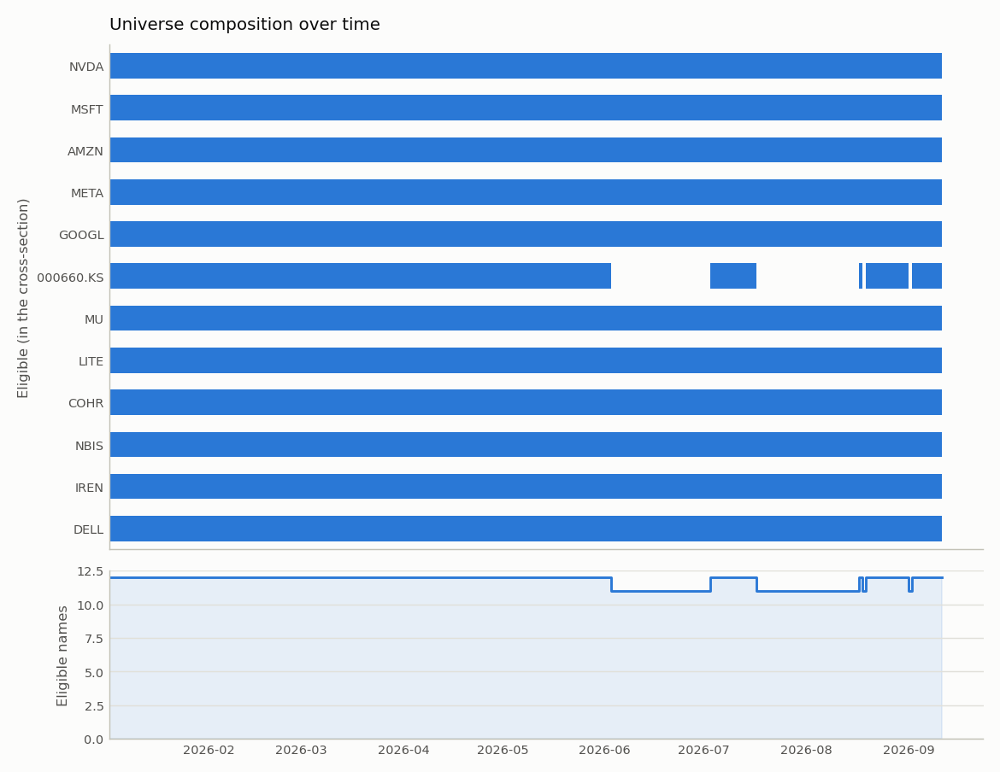
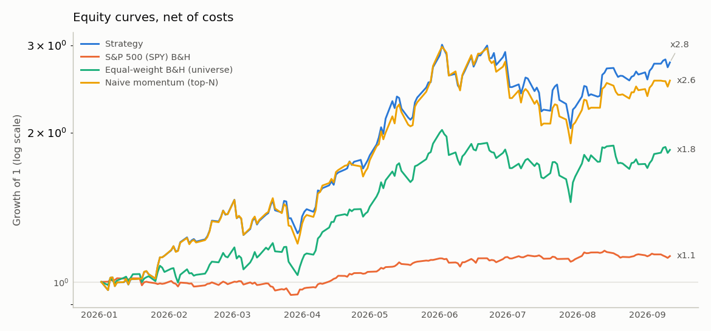
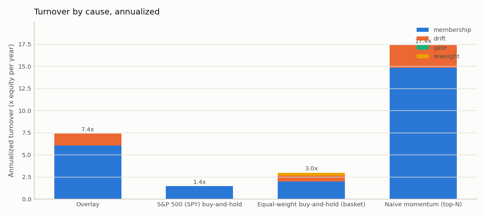
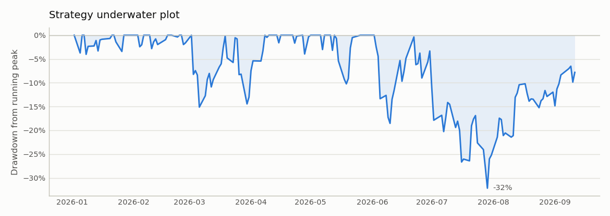
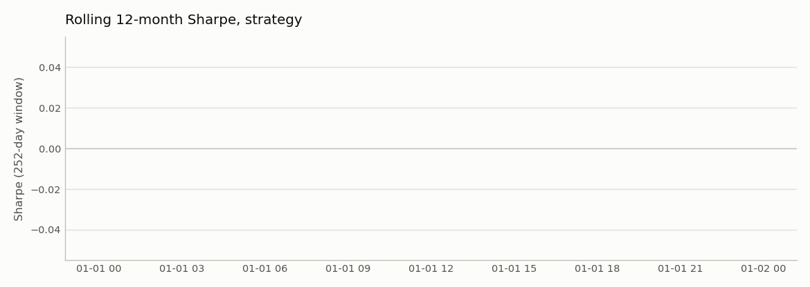
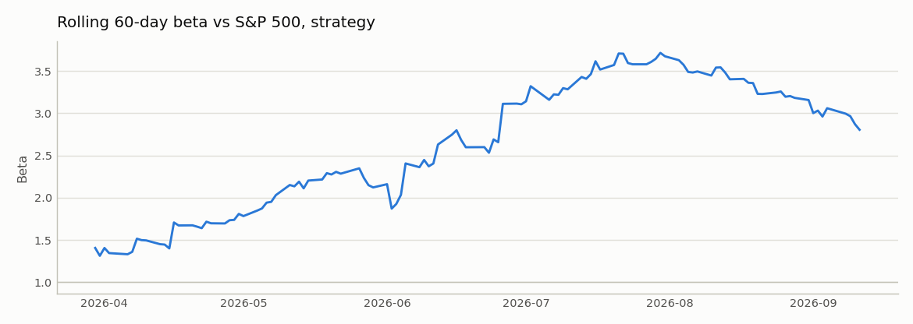
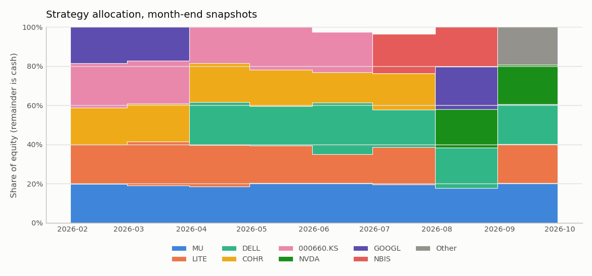
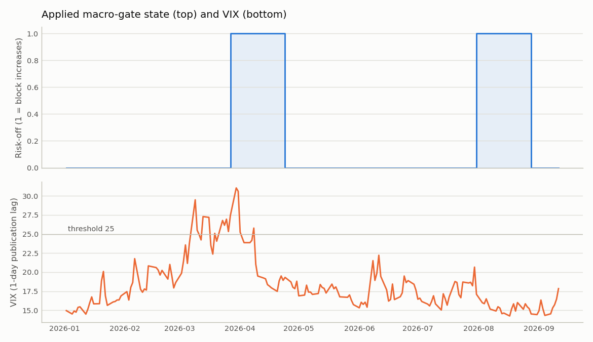

# thematic-alpha report — run `base_2026ytd`

**Hindsight bias, stated up front.** The universe was chosen in 2026 knowing which AI names had performed well. Every absolute return figure below is inflated by that selection and is **not** achievable ex-ante. The equal-weight buy-and-hold of the *same* basket is the benchmark that isolates what the rules add on top of the selection; read the strategy column against that one, not against the S&P 500.

> Research system, not a trading system. Nothing here is investment advice. All figures are net of transaction costs.

## Configuration

| Setting | Value |
|---|---|
| Backtest window | 2026-01-01 → 2026-09-11 |
| Universe | `data/reference/universe.csv`, 12 names, selection: hindsight; market: SPY |
| Base currency | EUR |
| Rebalance | weekly, friday |
| Execution | t + 1 session at the open |
| Costs | model=bps, 5 bps/side + 3 bps slippage, flat 1 EUR |
| Ranker | momentum_zscore, top 5 (exit rank 8), equal |
| Macro gate | block increases while any sub-gate is engaged (VIX>25 (release 20); 10y +40bp (release 32bp)/21d; WTI +20% (release 16%)/21d); exempt segments: defensive; scale factors and floor unused; evaluated monthly |
| Event mask | block new exposure 3 sessions before earnings (on) |
| Sizing | max weight 0.35, cash floor 0 |
| Liquidity screen | 21-day average traded value ≥ 5,000,000 EUR |
| Turnover control | position no-trade band 2 pp (on; strategy only) |
| Min history | 252 sessions |
| Macro publication lag | 1 session |

## Data quality

15 price series and 11 FRED series loaded; 38 single-day moves above 25% flagged for manual review. Full per-ticker table: `data_quality.md` next to this report. Known handling: SK Hynix truncated to 2003 (mis-adjusted 2002 reverse split in the source), zero-volume bars on Korean holidays dropped, master calendar = NYSE ∪ KRX sessions with forward-fill only across a name's own holidays.

## Universe composition

When each name enters the cross-section (backtest starts 2026-01-02; a date before that means the name was eligible from the first signal date). Liquidity-eligible is the first date the 21-day average traded value clears the screen.

| Ticker | First price | History-eligible | Liquidity-eligible | First eligible | Enters |
|---|---|---|---|---|---|
| NVDA | 1999-01-22 | 2000-01-20 | 1999-02-22 | 2000-01-20 | from start |
| MSFT | 1998-01-02 | 1998-12-31 | 1999-02-02 | 1999-02-02 | from start |
| AMZN | 1998-01-02 | 1998-12-31 | 1999-02-02 | 1999-02-02 | from start |
| META | 2012-05-18 | 2013-05-21 | 2012-06-18 | 2013-05-21 | from start |
| GOOGL | 2004-08-19 | 2005-08-17 | 2004-09-17 | 2005-08-17 | from start |
| 000660.KS | 2003-01-02 | 2004-01-08 | 2003-01-30 | 2004-01-08 | from start |
| MU | 1998-01-02 | 1998-12-31 | 1999-02-02 | 1999-02-02 | from start |
| LITE | 2015-07-23 | 2016-07-21 | 2015-08-20 | 2016-07-21 | from start |
| COHR | 1998-01-02 | 1998-12-31 | 2000-03-02 | 2000-03-02 | from start |
| NBIS | 2024-10-21 | 2025-10-22 | 2024-11-18 | 2025-10-22 | from start |
| IREN | 2021-11-17 | 2022-11-16 | 2021-12-16 | 2023-03-13 | from start |
| DELL | 2016-08-17 | 2017-08-16 | 2016-09-15 | 2017-08-16 | from start |

## Strategy activity

37 signal dates. Macro gate in **block-increases** mode: risk-off on 8 signal dates, 6 increases or entries blocked (that weight stayed in cash; exempt names: none). The scale factors and `min_exposure` are unused in this mode. The gate was evaluated on 10 of the 37 signal dates (monthly) and held constant in between; ranking stayed weekly. Event mask: **0 entries blocked pre-earnings** (28 ticker-dates masked; 0 tickers without earnings dates failed open).

Average cross-sectional rank of the held names: **3.34** (exit rank 8, top 5; plain top-5 gives 3.0 by construction). A higher value is the signal-quality cost of the rank buffer: it holds names the ranker would otherwise have replaced.

## Headline results (net of costs)

| Metric | Strategy | S&P 500 (SPY) B&H | Equal-weight B&H (universe) | Naive momentum (top-N) |
|---|---:|---:|---:|---:|
| Total return | 177.9% | 12.8% | 84.9% | 155.2% |
| CAGR | 339.5% | 19.0% | 143.5% | 288.3% |
| Annualized volatility | 59.7% | 12.7% | 45.7% | 60.6% |
| Sharpe (excess over DTB3) | 2.72 | 1.15 | 2.10 | 2.49 |
| Sortino (MAR 0) | 4.21 | 1.70 | 3.21 | 3.80 |
| Max drawdown | -32.2% | -7.5% | -28.5% | -36.2% |
| Max DD peak | 2026-06-02 | 2026-01-09 | 2026-06-02 | 2026-06-02 |
| Max DD trough | 2026-07-29 | 2026-03-27 | 2026-07-29 | 2026-07-29 |
| Max DD recovery | n/a | 2026-04-16 | n/a | n/a |
| Max DD duration (days) | 101 | 97 | 101 | 101 |
| Calmar | 10.55 | 2.54 | 5.03 | 7.97 |
| Alpha vs S&P 500 (ann.) | 126.4% | -1.2% | 60.4% | 112.1% |
| Beta vs S&P 500 | 2.27 | 0.99 | 2.23 | 2.42 |
| Historical VaR 95% (daily) | 6.2% | 1.3% | 4.8% | 5.7% |
| Historical VaR 99% (daily) | 8.3% | 1.7% | 5.9% | 8.6% |
| Parametric VaR 95% (daily) | 5.5% | 1.2% | 4.3% | 5.7% |
| Parametric VaR 99% (daily) | 8.1% | 1.8% | 6.3% | 8.3% |
| CVaR / ES 95% (daily) | 7.8% | 1.7% | 5.8% | 8.1% |
| Excess kurtosis (daily) | 0.26 | 1.40 | 0.28 | 0.21 |
| Hit rate (weekly periods) | 68.6% | 57.1% | 60.0% | 68.6% |
| Average win (weekly period) | 8.1% | 1.5% | 6.4% | 8.0% |
| Average loss (weekly period) | -6.6% | -1.1% | -4.5% | -7.2% |
| Annualized turnover | 7.38 | 1.45 | 2.96 | 17.39 |
| Total costs paid | 79.16 | 8.00 | 22.83 | 190.51 |
| Costs as % of final equity | 0.28% | 0.07% | 0.12% | 0.75% |

Against equal-weight buy-and-hold of the same basket the strategy's CAGR is higher (339.5% vs 143.5%), its Sharpe is higher (2.72 vs 2.10), and its maximum drawdown is deeper (-32.2% vs -28.5%).

VaR note: parametric (normal) 99% VaR is 8.1% against a historical 8.3%; daily excess kurtosis is 0.26. The normal assumption understates the tail.

## Turnover attribution

Annualized turnover split by cause (see `backtest/attribution.py`): **membership** (entries and exits), **drift** (re-trading a held name back to an unchanged target, including the residual of earlier skipped or cash-scaled trades), **gate** (the macro gate changing the book) and **reweight** (ranker, mask and cap effects on a held name). Causes sum to the annualized turnover in the table above.

| Run | membership | drift | gate | reweight | total |
|---|---:|---:|---:|---:|---:|
| Strategy | 6.05 | 1.33 | 0.00 | 0.00 | 7.38 |
| S&P 500 (SPY) B&H | 1.45 | 0.00 | 0.00 | 0.00 | 1.45 |
| Equal-weight B&H (universe) | 1.96 | 0.68 | 0.00 | 0.32 | 2.96 |
| Naive momentum (top-N) | 14.82 | 2.56 | 0.00 | 0.00 | 17.39 |

Macro gate: 4 state transitions over 37 signal dates (5.8 per year); 0 of them reverse within 1 signal date and 0 within 2. The gate accounts for 0.0% of the strategy's turnover. In block mode a blocked *entry* that executes after the release is membership turnover, not gate turnover, so this share only counts blocked increases of held names; with equal weights and a full book those are rare, and the gate's effect shows up as deferred membership and higher cash instead.

## FX decomposition (strategy)

|  | In EUR | In local currencies |
|---|---:|---:|
| Total return | 177.9% | 178.8% |
| CAGR | 339.5% | 341.4% |

FX contribution: -1.9% per year of CAGR; in total the EUR result differs from the local-currency result by -0.8% of initial capital. Positions are unhedged KRW and USD exposure held by a EUR investor.

## Largest drawdowns

**Strategy**

| Depth | Peak | Trough | Recovery | Duration (days) |
|---|---:|---:|---:|---:|
| -32.2% | 2026-06-02 | 2026-07-29 | not recovered | 101 |
| -15.1% | 2026-03-02 | 2026-03-06 | 2026-04-08 | 37 |
| -10.2% | 2026-05-13 | 2026-05-19 | 2026-05-26 | 13 |
| -4.0% | 2026-01-07 | 2026-01-08 | 2026-01-21 | 14 |
| -3.9% | 2026-04-27 | 2026-04-28 | 2026-05-01 | 4 |

**Equal-weight B&H (universe)**

| Depth | Peak | Trough | Recovery | Duration (days) |
|---|---:|---:|---:|---:|
| -28.5% | 2026-06-02 | 2026-07-29 | not recovered | 101 |
| -13.9% | 2026-03-19 | 2026-03-30 | 2026-04-08 | 20 |
| -9.7% | 2026-03-02 | 2026-03-06 | 2026-03-18 | 16 |
| -8.4% | 2026-05-14 | 2026-05-19 | 2026-05-26 | 12 |
| -7.5% | 2026-01-28 | 2026-02-05 | 2026-02-19 | 22 |

## Figures

