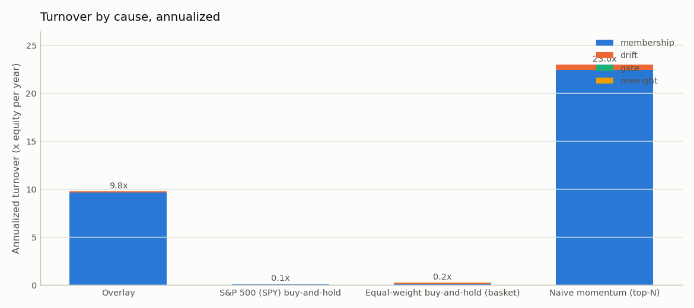
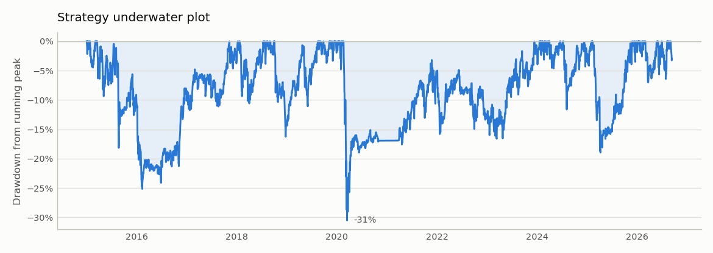
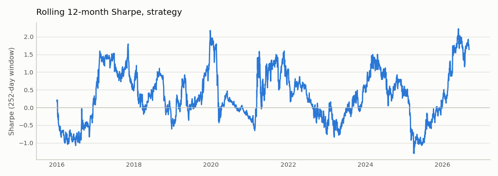
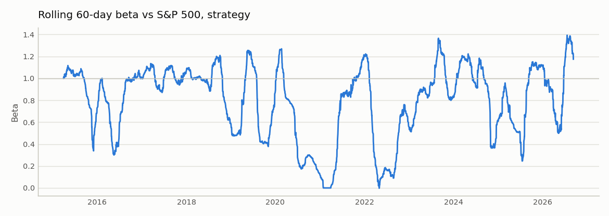
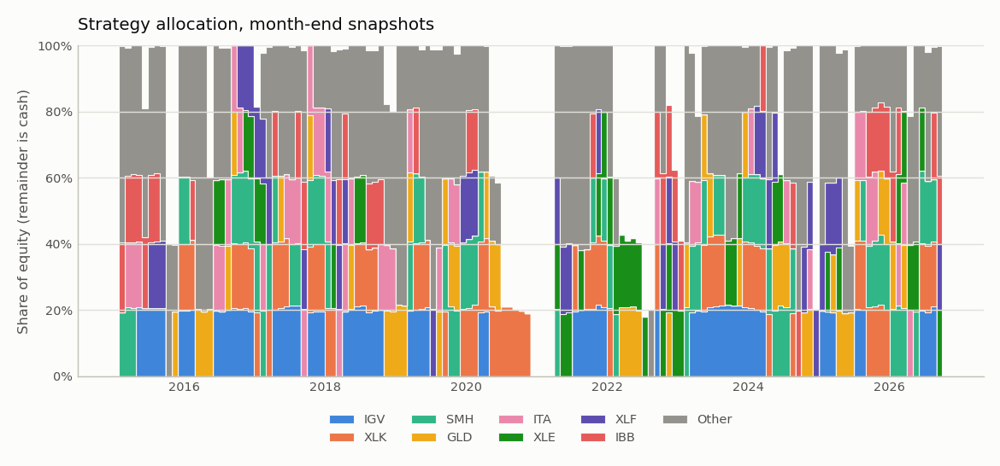
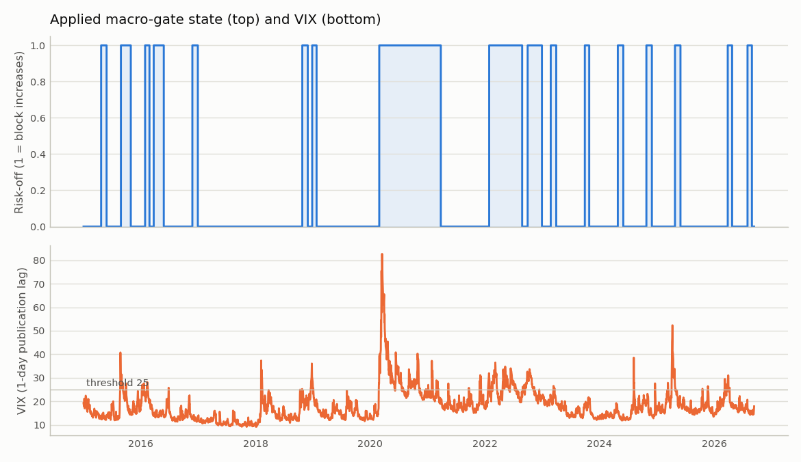

# thematic-alpha report — run `etf`

**Universe definition (point-in-time).** The universe is a fixed list of 17 exchange-traded funds chosen by category (2 defensive, 11 sector, 4 thematic), not by past performance, from `data/reference/universe_etf.csv`. A name enters the cross-section only once it has 252 observed sessions and a 21-day average traded value of at least 5,000,000 EUR, so the investable set on every signal date is defined from data available on that date (composition table and figure below). Residual bias: the list holds only funds that still trade at the snapshot date; funds in these categories that were liquidated or merged away are absent, which flatters the equal-weight buy-and-hold of the basket (ETF-delisting bias). It is much smaller than hindsight stock selection, but it is not zero.

> Research system, not a trading system. Nothing here is investment advice. All figures are net of transaction costs.

## Configuration

| Setting | Value |
|---|---|
| Backtest window | 2015-01-01 → 2026-09-11 |
| Universe | `data/reference/universe_etf.csv`, 17 names, selection: point_in_time; market: SPY |
| Base currency | EUR |
| Rebalance | weekly, friday |
| Execution | t + 1 session at the open |
| Costs | model=bps, 5 bps/side + 3 bps slippage, flat 1 EUR |
| Ranker | momentum_zscore, top 5 (exit rank 8), equal |
| Macro gate | block increases while any sub-gate is engaged (VIX>25 (release 20); 10y +40bp (release 32bp)/21d; WTI +20% (release 16%)/21d); exempt segments: defensive; scale factors and floor unused; evaluated monthly |
| Event mask | disabled |
| Sizing | max weight 0.35, cash floor 0; house-money rule: off |
| Liquidity screen | 21-day average traded value ≥ 5,000,000 EUR |
| Turnover control | position no-trade band 2 pp (on; strategy only) |
| Min history | 252 sessions |
| Macro publication lag | 1 session |

## Data quality

18 price series and 11 FRED series loaded; 0 single-day moves above 25% flagged for manual review. Full per-ticker table: `data_quality.md` next to this report. All names trade on US venues, so the master calendar is the NYSE session calendar; no cross-exchange alignment was needed.

## Universe composition

When each name enters the cross-section (backtest starts 2015-01-02; a date before that means the name was eligible from the first signal date). Liquidity-eligible is the first date the 21-day average traded value clears the screen.

| Ticker | First price | History-eligible | Liquidity-eligible | First eligible | Enters |
|---|---|---|---|---|---|
| XLK | 1998-12-22 | 1999-12-21 | 1999-02-02 | 1999-12-21 | from start |
| XLF | 1998-12-22 | 1999-12-21 | 1999-09-21 | 1999-12-21 | from start |
| XLE | 1998-12-22 | 1999-12-21 | 1999-03-12 | 1999-12-21 | from start |
| XLV | 1998-12-22 | 1999-12-21 | 2000-01-13 | 2000-01-13 | from start |
| XLY | 1998-12-22 | 1999-12-21 | 1999-12-27 | 1999-12-27 | from start |
| XLP | 1998-12-22 | 1999-12-21 | 1999-12-22 | 1999-12-22 | from start |
| XLI | 1998-12-22 | 1999-12-21 | 1999-12-27 | 1999-12-27 | from start |
| XLU | 1998-12-22 | 1999-12-21 | 2000-06-27 | 2000-06-27 | from start |
| XLB | 1998-12-22 | 1999-12-21 | 1999-04-30 | 2000-01-03 | from start |
| XLRE | 2015-10-08 | 2016-10-06 | 2016-09-12 | 2016-10-06 | mid-window |
| XLC | 2018-06-19 | 2019-06-19 | 2018-07-18 | 2019-06-19 | mid-window |
| SMH | 2000-06-05 | 2001-06-04 | 2000-07-03 | 2001-06-04 | from start |
| IGV | 2001-07-17 | 2002-07-22 | 2001-12-04 | 2002-07-22 | from start |
| IBB | 2001-02-12 | 2002-02-15 | 2001-06-11 | 2002-02-15 | from start |
| ITA | 2006-05-05 | 2007-05-07 | 2007-08-30 | 2007-08-30 | from start |
| TLT | 2002-07-30 | 2003-07-29 | 2002-08-27 | 2003-07-29 | from start |
| GLD | 2004-11-18 | 2005-11-16 | 2004-12-17 | 2005-11-16 | from start |

## Strategy activity

611 signal dates. Macro gate in **block-increases** mode: risk-off on 172 signal dates, 416 increases or entries blocked (that weight stayed in cash; exempt names: TLT, GLD). The scale factors and `min_exposure` are unused in this mode. The gate was evaluated on 142 of the 611 signal dates (monthly) and held constant in between; ranking stayed weekly. Event mask: **disabled** (ETFs report no earnings; nothing to mask).

Average cross-sectional rank of the held names: **3.55** (exit rank 8, top 5; plain top-5 gives 3.0 by construction). A higher value is the signal-quality cost of the rank buffer: it holds names the ranker would otherwise have replaced.

## Headline results (net of costs)

| Metric | Strategy | S&P 500 (SPY) B&H | Equal-weight B&H (universe) | Naive momentum (top-N) |
|---|---:|---:|---:|---:|
| Total return | 95.3% | 364.5% | 339.6% | 204.7% |
| CAGR | 5.9% | 14.1% | 13.5% | 10.0% |
| Annualized volatility | 16.1% | 18.6% | 16.9% | 17.1% |
| Sharpe (excess over DTB3) | 0.31 | 0.69 | 0.71 | 0.52 |
| Sortino (MAR 0) | 0.42 | 0.96 | 1.00 | 0.72 |
| Max drawdown | -30.5% | -33.5% | -29.9% | -27.0% |
| Max DD peak | 2020-02-19 | 2020-02-19 | 2020-02-19 | 2020-02-19 |
| Max DD trough | 2020-03-16 | 2020-03-23 | 2020-03-23 | 2020-03-23 |
| Max DD recovery | 2024-01-19 | 2021-01-07 | 2021-01-08 | 2021-01-12 |
| Max DD duration (days) | 1,430 | 323 | 324 | 328 |
| Calmar | 0.19 | 0.42 | 0.45 | 0.37 |
| Alpha vs S&P 500 (ann.) | -4.1% | -0.1% | 0.6% | -1.1% |
| Beta vs S&P 500 | 0.70 | 1.00 | 0.89 | 0.77 |
| Historical VaR 95% (daily) | 1.6% | 1.7% | 1.6% | 1.7% |
| Historical VaR 99% (daily) | 3.0% | 3.3% | 2.9% | 3.2% |
| Parametric VaR 95% (daily) | 1.6% | 1.9% | 1.7% | 1.7% |
| Parametric VaR 99% (daily) | 2.3% | 2.7% | 2.4% | 2.5% |
| CVaR / ES 95% (daily) | 2.5% | 2.9% | 2.6% | 2.6% |
| Excess kurtosis (daily) | 9.01 | 10.87 | 9.36 | 4.17 |
| Hit rate (weekly periods) | 59.4% | 60.3% | 59.3% | 57.6% |
| Average win (weekly period) | 1.3% | 1.7% | 1.6% | 1.6% |
| Average loss (weekly period) | -1.6% | -1.8% | -1.6% | -1.7% |
| Annualized turnover | 9.75 | 0.09 | 0.23 | 22.98 |
| Total costs paid | 1,149.91 | 7.99 | 23.80 | 3,403.97 |
| Costs as % of final equity | 5.89% | 0.02% | 0.05% | 11.17% |

Against equal-weight buy-and-hold of the same basket the strategy's CAGR is lower (5.9% vs 13.5%), its Sharpe is lower (0.31 vs 0.71), and its maximum drawdown is deeper (-30.5% vs -29.9%). **This is an underperformance result**: the rules did not add value over simply holding the (hindsight-selected) basket, net of costs.

VaR note: parametric (normal) 99% VaR is 2.3% against a historical 3.0%; daily excess kurtosis is 9.01. The normal assumption understates the tail.

## Turnover attribution

Annualized turnover split by cause (see `backtest/attribution.py`): **membership** (entries and exits), **drift** (re-trading a held name back to an unchanged target, including the residual of earlier skipped or cash-scaled trades), **gate** (the macro gate changing the book) and **reweight** (ranker, mask and cap effects on a held name). Causes sum to the annualized turnover in the table above.

| Run | membership | drift | gate | reweight | total |
|---|---:|---:|---:|---:|---:|
| Strategy | 9.66 | 0.09 | 0.00 | 0.00 | 9.75 |
| S&P 500 (SPY) B&H | 0.09 | 0.00 | 0.00 | 0.00 | 0.09 |
| Equal-weight B&H (universe) | 0.15 | 0.03 | 0.00 | 0.05 | 0.23 |
| Naive momentum (top-N) | 22.40 | 0.58 | 0.00 | 0.00 | 22.98 |

Macro gate: 34 state transitions over 611 signal dates (2.9 per year); 0 of them reverse within 1 signal date and 0 within 2. The gate accounts for 0.0% of the strategy's turnover. In block mode a blocked *entry* that executes after the release is membership turnover, not gate turnover, so this share only counts blocked increases of held names; with equal weights and a full book those are rare, and the gate's effect shows up as deferred membership and higher cash instead.

## FX decomposition (strategy)

|  | In EUR | In local currencies |
|---|---:|---:|
| Total return | 95.3% | 99.2% |
| CAGR | 5.9% | 6.1% |

FX contribution: -0.2% per year of CAGR; in total the EUR result differs from the local-currency result by -3.9% of initial capital. Positions are unhedged USD exposure held by a EUR investor.

## Largest drawdowns

**Strategy**

| Depth | Peak | Trough | Recovery | Duration (days) |
|---|---:|---:|---:|---:|
| -30.5% | 2020-02-19 | 2020-03-16 | 2024-01-19 | 1,430 |
| -25.2% | 2015-03-19 | 2016-02-11 | 2017-11-08 | 965 |
| -19.0% | 2025-02-10 | 2025-04-08 | 2025-11-26 | 289 |
| -16.3% | 2018-10-03 | 2018-12-24 | 2019-08-15 | 316 |
| -11.6% | 2024-07-10 | 2024-08-05 | 2025-02-03 | 208 |

**Equal-weight B&H (universe)**

| Depth | Peak | Trough | Recovery | Duration (days) |
|---|---:|---:|---:|---:|
| -29.9% | 2020-02-19 | 2020-03-23 | 2021-01-08 | 324 |
| -21.4% | 2025-02-19 | 2025-04-21 | 2025-10-01 | 224 |
| -18.0% | 2015-04-15 | 2016-02-11 | 2016-07-15 | 457 |
| -16.2% | 2018-10-03 | 2018-12-24 | 2019-02-15 | 135 |
| -15.0% | 2022-01-03 | 2022-06-16 | 2022-08-12 | 221 |

## Figures

