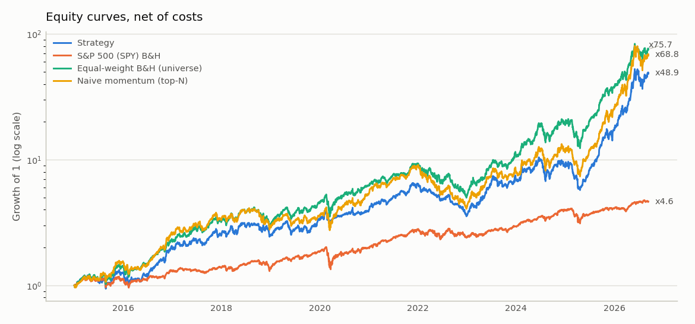
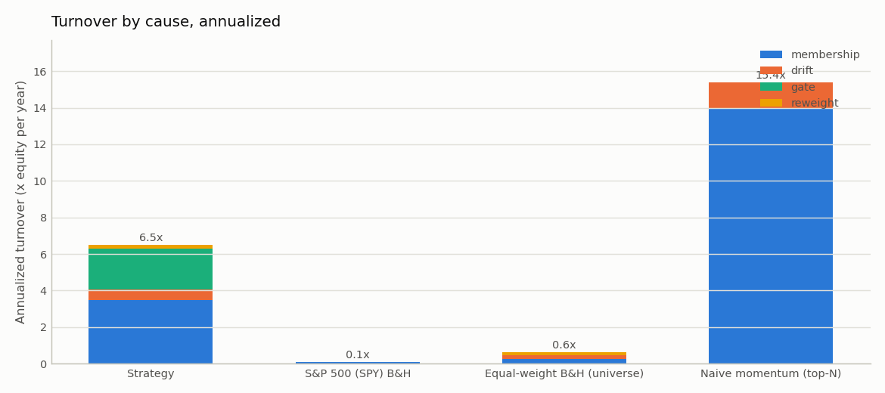
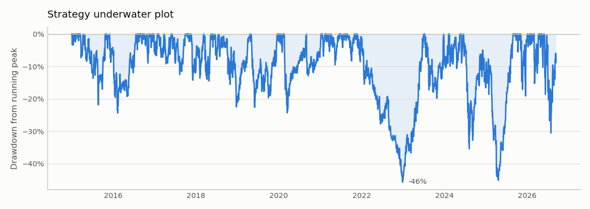
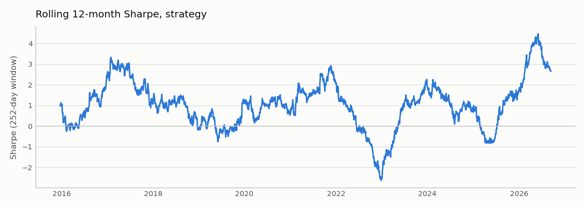
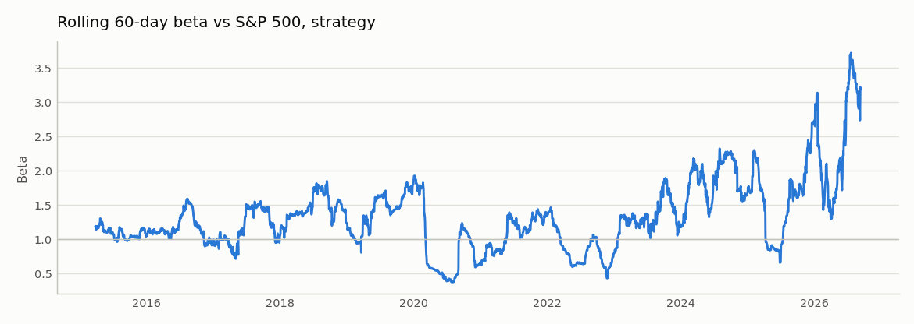
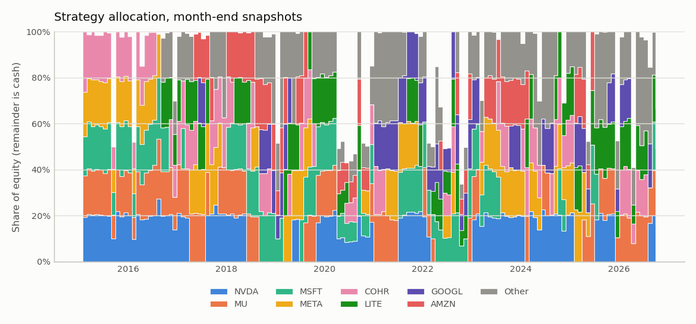
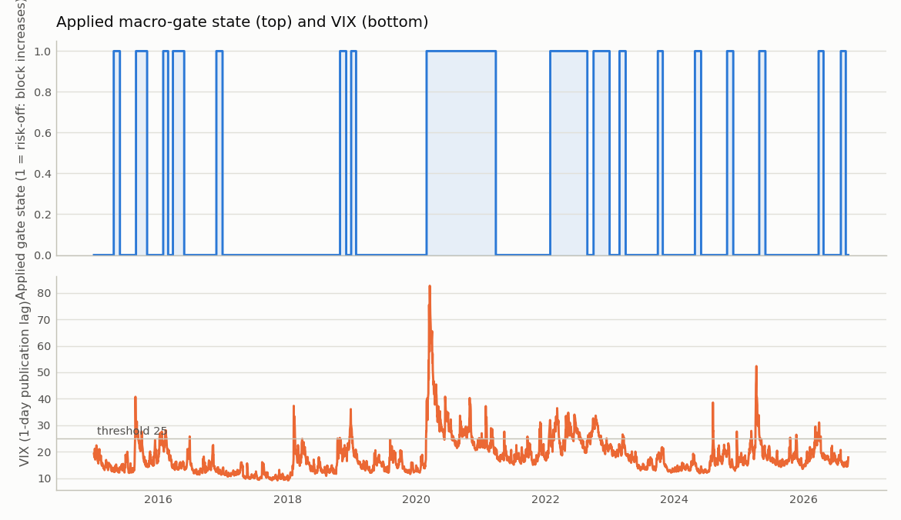

# thematic-alpha report — run `base`

**Hindsight bias, stated up front.** The universe was chosen in 2026 knowing which AI names had performed well. Every absolute return figure below is inflated by that selection and is **not** achievable ex-ante. The equal-weight buy-and-hold of the *same* basket is the benchmark that isolates what the rules add on top of the selection; read the strategy column against that one, not against the S&P 500.

> Research system, not a trading system. Nothing here is investment advice. All figures are net of transaction costs.

## Configuration

| Setting | Value |
|---|---|
| Backtest window | 2015-01-01 → 2026-09-11 |
| Base currency | EUR |
| Rebalance | weekly, friday |
| Execution | t + 1 session at the open |
| Costs | model=bps, 5 bps/side + 3 bps slippage, flat 1 EUR |
| Ranker | momentum_zscore, top 5 (exit rank 8), equal |
| Macro gate | VIX>25→×0.5; 10y +40bp/21d→×0.7; WTI +20%/21d→×0.85; floor 0.3; multiplicative |
| Event mask | block new exposure 3 sessions before earnings (on) |
| Sizing | max weight 0.35, cash floor 0; house-money rule: Layer 2 (not applied) |
| Turnover control | position no-trade band 2 pp (on; strategy only) |
| Min history | 252 sessions |
| Macro publication lag | 1 session |

## Data quality

15 price series and 11 FRED series loaded; 38 single-day moves above 25% flagged for manual review. Full per-ticker table: `outputs/data_quality.md`. Known handling: SK Hynix truncated to 2003 (mis-adjusted 2002 reverse split in the source), zero-volume bars on Korean holidays dropped, master calendar = NYSE ∪ KRX sessions with forward-fill only across a name's own holidays.

## Strategy activity

611 signal dates. Macro-gate exposure averaged 0.92 (minimum 0.30; below 1.0 on 118 signal dates). Event mask: **8 entries blocked pre-earnings** (323 ticker-dates masked; 0 tickers without earnings dates failed open).

Average cross-sectional rank of the held names: **3.81** (exit rank 8, top 5; plain top-5 gives 3.0 by construction). A higher value is the signal-quality cost of the rank buffer: it holds names the ranker would otherwise have replaced.

## Headline results (net of costs)

| Metric | Strategy | S&P 500 (SPY) B&H | Equal-weight B&H (universe) | Naive momentum (top-N) |
|---|---:|---:|---:|---:|
| Total return | 4791.7% | 364.5% | 7474.4% | 6780.2% |
| CAGR | 38.2% | 13.6% | 43.3% | 42.2% |
| Annualized volatility | 30.7% | 18.4% | 31.2% | 34.0% |
| Sharpe (excess over DTB3) | 1.14 | 0.67 | 1.24 | 1.14 |
| Sortino (MAR 0) | 1.67 | 0.95 | 1.82 | 1.67 |
| Max drawdown | -45.6% | -33.5% | -46.7% | -55.2% |
| Max DD peak | 2021-11-25 | 2020-02-19 | 2021-12-27 | 2022-01-03 |
| Max DD trough | 2022-12-28 | 2020-03-23 | 2022-12-28 | 2022-12-28 |
| Max DD recovery | 2023-06-30 | 2021-01-07 | 2023-07-05 | 2024-02-09 |
| Max DD duration (days) | 582 | 323 | 555 | 767 |
| Calmar | 0.84 | 0.41 | 0.93 | 0.76 |
| Alpha vs S&P 500 (ann.) | 21.9% | -0.1% | 22.6% | 23.0% |
| Beta vs S&P 500 | 1.05 | 1.00 | 1.30 | 1.28 |
| Historical VaR 95% (daily) | 3.0% | 1.7% | 3.2% | 3.3% |
| Historical VaR 99% (daily) | 5.2% | 3.3% | 5.3% | 5.8% |
| Parametric VaR 95% (daily) | 3.0% | 1.8% | 3.1% | 3.4% |
| Parametric VaR 99% (daily) | 4.3% | 2.6% | 4.4% | 4.8% |
| CVaR / ES 95% (daily) | 4.5% | 2.8% | 4.6% | 5.0% |
| Excess kurtosis (daily) | 3.58 | 11.29 | 3.70 | 3.42 |
| Hit rate (weekly periods) | 59.9% | 60.3% | 61.7% | 60.4% |
| Average win (weekly period) | 3.4% | 1.7% | 3.5% | 3.8% |
| Average loss (weekly period) | -3.3% | -1.8% | -3.5% | -3.7% |
| Annualized turnover | 6.50 | 0.08 | 0.62 | 15.39 |
| Total costs paid | 4,896.76 | 7.99 | 1,229.48 | 13,034.81 |
| Costs as % of final equity | 1.00% | 0.02% | 0.16% | 1.89% |

Against equal-weight buy-and-hold of the same basket the strategy's CAGR is lower (38.2% vs 43.3%), its Sharpe is lower (1.14 vs 1.24), and its maximum drawdown is shallower (-45.6% vs -46.7%). The rules gave up total return relative to holding the basket in exchange for a better risk-adjusted profile.

VaR note: parametric (normal) 99% VaR is 4.3% against a historical 5.2%; daily excess kurtosis is 3.58. The normal assumption understates the tail.

## Turnover attribution

Annualized turnover split by cause (see `backtest/attribution.py`): **membership** (entries and exits), **drift** (re-trading a held name back to an unchanged target, including the residual of earlier skipped or cash-scaled trades), **gate** (the macro gate changing the book) and **reweight** (ranker, mask and cap effects on a held name). Causes sum to the annualized turnover in the table above.

| Run | membership | drift | gate | reweight | total |
|---|---:|---:|---:|---:|---:|
| Strategy | 3.49 | 0.57 | 2.24 | 0.19 | 6.50 |
| S&P 500 (SPY) B&H | 0.08 | 0.00 | 0.00 | 0.00 | 0.08 |
| Equal-weight B&H (universe) | 0.27 | 0.21 | 0.00 | 0.14 | 0.62 |
| Naive momentum (top-N) | 13.96 | 1.43 | 0.00 | 0.00 | 15.39 |

Macro gate: 88 state transitions over 611 signal dates (7.3 per year); 27 of them reverse within 1 signal date and 34 within 2. The gate accounts for 34.4% of the strategy's turnover.

## FX decomposition (strategy)

|  | In EUR | In local currencies |
|---|---:|---:|
| Total return | 4791.7% | 4494.0% |
| CAGR | 38.2% | 37.5% |

FX contribution: 0.7% per year of CAGR; in total the EUR result differs from the local-currency result by 297.7% of initial capital. Positions are unhedged USD and KRW exposure held by a EUR investor.

## Largest drawdowns

**Strategy**

| Depth | Peak | Trough | Recovery | Duration (days) |
|---|---:|---:|---:|---:|
| -45.6% | 2021-11-25 | 2022-12-28 | 2023-06-30 | 582 |
| -45.1% | 2024-06-18 | 2025-04-21 | 2025-08-28 | 436 |
| -30.5% | 2026-06-02 | 2026-07-29 | not recovered | 101 |
| -24.3% | 2015-12-01 | 2016-02-11 | 2016-07-20 | 232 |
| -24.3% | 2020-02-19 | 2020-03-16 | 2020-09-01 | 195 |

**Equal-weight B&H (universe)**

| Depth | Peak | Trough | Recovery | Duration (days) |
|---|---:|---:|---:|---:|
| -46.7% | 2021-12-27 | 2022-12-28 | 2023-07-05 | 555 |
| -41.5% | 2025-01-23 | 2025-04-21 | 2025-07-09 | 167 |
| -33.4% | 2020-02-19 | 2020-03-16 | 2020-07-02 | 134 |
| -32.2% | 2018-08-31 | 2018-12-24 | 2019-05-03 | 245 |
| -29.8% | 2024-06-18 | 2024-08-07 | 2024-11-07 | 142 |

## Figures

