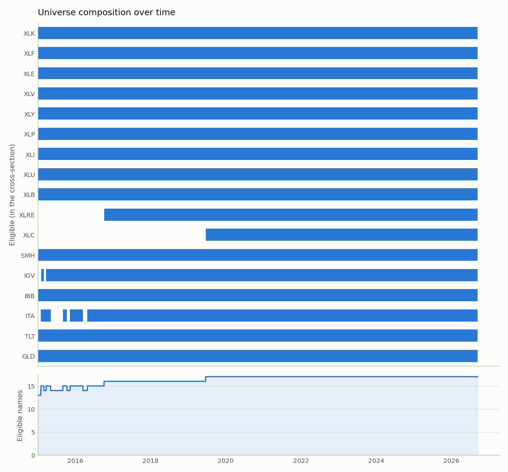

# thematic-alpha study — brief v2: point-in-time ETF universe vs the hindsight control

Data snapshot 2026-09-11; window 2015-01-01 → 2026-09-11; costs 5 bps/side + 3 bps slippage; base currency EUR; top 5. All figures net of costs, annualized on the NYSE session calendar. Every parameter was *set from standard practice, not optimised* and committed before the run: [docs/preregistration_v2.md](../docs/preregistration_v2.md). Universes: `data/reference/universe_etf.csv` (17 names, etf), `data/reference/universe.csv` (12 names, base).

## 1. ETF headline: strategy vs equal-weight B&H (ETF) vs SPY vs naive momentum

|  | Strategy (chosen) | S&P 500 (SPY) B&H | Equal-weight B&H (universe) | Naive momentum (top-N) |
|---|---:|---:|---:|---:|
| CAGR | 5.7% | 14.1% | 13.5% | 10.0% |
| Sharpe | 0.30 | 0.69 | 0.71 | 0.52 |
| Max drawdown | -30.5% | -33.5% | -29.9% | -27.0% |
| Annualized turnover | 9.75 | 0.09 | 0.23 | 22.98 |
| Costs (% of final equity) | 5.95% | 0.02% | 0.05% | 11.17% |

On the point-in-time ETF universe the strategy's CAGR is lower than equal-weight buy-and-hold of the same 17 ETFs (5.7% vs 13.5%), its Sharpe is lower (0.30 vs 0.71) and its maximum drawdown is deeper (-30.5% vs -29.9%). Against SPY it is lower on CAGR (14.1%) and lower on Sharpe (0.69); against naive top-5 momentum it is lower on Sharpe (0.52). **The rules do not beat holding the basket on this universe**, net of costs.

## 2. Selection bias: identical chosen rules, 12 stocks vs 17 ETFs

|  | 12 stocks (hindsight) | 17 ETFs (point-in-time) | difference |
|---|---:|---:|---:|
| Strategy (chosen rules) CAGR | 39.8% | 5.7% | 34.1% |
| Strategy Sharpe | 1.13 | 0.30 | 0.83 |
| Strategy max drawdown | -42.4% | -30.5% | -11.8% |
| Equal-weight B&H CAGR | 40.4% | 13.5% | 26.9% |
| Equal-weight B&H Sharpe | 1.19 | 0.71 | 0.47 |
| SPY B&H CAGR (same in both) | 14.1% | 14.1% |  |

Same rules, same window, same costs: **39.8% CAGR with the hindsight universe, 5.7% without** — a difference of 34.1% per year and 0.83 of Sharpe (1.13 vs 0.30). The equal-weight buy-and-hold shows the same gap without any rules: 40.4% for the 12 stocks vs 13.5% for the 17 ETFs (26.9% per year, Sharpe 1.19 vs 0.71). The universe, not the rules, is where the Layer 1 return came from.

## 3. Turnover decomposition: L1 baseline vs chosen, both universes

| Universe | Rules | membership | drift | gate | reweight | total | held rank | costs %eq |
|---|---|---:|---:|---:|---:|---:|---:|---:|
| etf | L1 baseline | 15.59 | 0.36 | 1.79 | 7.26 | 25.00 | 3.00 | 14.32% |
| etf | chosen | 9.66 | 0.09 | 0.00 | 0.00 | 9.75 | 3.55 | 5.95% |
| base | L1 baseline | 9.18 | 0.97 | 1.75 | 6.87 | 18.77 | 3.00 | 2.62% |
| base | chosen | 3.40 | 0.60 | 0.00 | 0.14 | 4.14 | 3.82 | 0.58% |

etf: annualized turnover 25.00x → 9.75x (61% lower), average held rank 3.00 → 3.55 (the signal-quality cost of the rank buffer: 0.55 ranks).

base: annualized turnover 18.77x → 4.14x (78% lower), average held rank 3.00 → 3.82 (the signal-quality cost of the rank buffer: 0.82 ranks).

In block mode a blocked entry that executes after the release counts as membership, so the gate column understates the gate's effect there; the gate-disabled reference row in the ablation is the honest measure of what the gate does.

## 4. Ablation

Rows are declared in `study.py` (`VARIANTS`): the L1 baseline, the cumulative chain in the brief's order, each knob alone on the baseline, the softmax sensitivity set on the chosen config, and two references (gate disabled; liquidity screen off). The liquidity screen is part of the universe definition and stays on in every other row; note that the screen also changes the equal-weight buy-and-hold (re-equalized on every eligibility change), so the screen-off row is not comparable to the benchmark table above. Nothing here was used to change a chosen value.

| Universe | Variant | CAGR | Sharpe | Max DD | Turnover | member. | drift | gate | reweight | Costs %eq | Held rank | Gate tr./yr | Avg cash | Eff. N |
|---|---|---:|---:|---:|---:|---:|---:|---:|---:|---:|---:|---:|---:|---:|
| etf | L1 baseline (tiers, top-N, no band, gate scale/weekly) | 6.3% | 0.34 | -21.3% | 25.00 | 15.59 | 0.36 | 1.79 | 7.26 | 14.32% | 3.00 | 7.4 | 9% | 4.4 |
| etf | + equal weight | 7.8% | 0.44 | -20.8% | 23.09 | 20.54 | 0.48 | 2.07 | 0.00 | 12.64% | 3.00 | 7.4 | 9% | 5.0 |
| etf | + hysteresis (exit rank 8) | 7.4% | 0.40 | -22.5% | 12.65 | 9.93 | 0.53 | 2.19 | 0.00 | 7.29% | 3.55 | 7.4 | 9% | 5.0 |
| etf | + position band 2pp | 7.3% | 0.40 | -22.5% | 12.02 | 9.76 | 0.12 | 2.13 | 0.00 | 6.94% | 3.55 | 7.4 | 9% | 5.0 |
| etf | + gate: block increases | 8.7% | 0.45 | -30.5% | 10.21 | 10.12 | 0.09 | 0.00 | 0.00 | 5.44% | 3.55 | 5.8 | 5% | 4.8 |
| etf | + gate: Schmitt trigger | 6.7% | 0.35 | -30.5% | 9.86 | 9.77 | 0.09 | 0.00 | 0.00 | 5.68% | 3.55 | 6.0 | 11% | 4.6 |
| etf | + gate: monthly evaluation (= chosen) | 5.7% | 0.30 | -30.5% | 9.75 | 9.66 | 0.09 | 0.00 | 0.00 | 5.95% | 3.55 | 2.9 | 14% | 4.5 |
| etf | L1 + equal weight only | 7.8% | 0.44 | -20.8% | 23.09 | 20.54 | 0.48 | 2.07 | 0.00 | 12.64% | 3.00 | 7.4 | 9% | 5.0 |
| etf | L1 + hysteresis (exit rank 8) only | 6.4% | 0.34 | -22.1% | 18.03 | 8.35 | 0.40 | 1.87 | 7.41 | 10.72% | 3.55 | 7.4 | 9% | 4.4 |
| etf | L1 + position band 2pp only | 6.4% | 0.34 | -21.4% | 24.60 | 15.50 | 0.20 | 1.75 | 7.15 | 14.05% | 3.00 | 7.4 | 9% | 4.4 |
| etf | L1 + gate: block increases only | 5.1% | 0.26 | -25.5% | 22.90 | 15.46 | 0.38 | 0.14 | 6.92 | 14.36% | 3.00 | 5.8 | 9% | 4.2 |
| etf | L1 + gate: Schmitt trigger only | 6.1% | 0.33 | -22.1% | 24.20 | 15.07 | 0.34 | 1.82 | 6.97 | 13.97% | 3.00 | 7.6 | 13% | 4.4 |
| etf | L1 + gate: monthly evaluation only | 6.1% | 0.32 | -22.3% | 24.15 | 15.58 | 0.37 | 0.88 | 7.32 | 14.07% | 3.00 | 3.5 | 9% | 4.4 |
| etf | chosen with softmax τ=0.5 | 0.8% | -0.03 | -26.2% | 14.63 | 4.68 | 0.27 | 0.09 | 9.60 | 11.99% | 3.55 | 2.9 | 39% | 2.6 |
| etf | chosen with softmax τ=1 | 2.4% | 0.09 | -28.0% | 14.42 | 6.79 | 0.32 | 0.08 | 7.24 | 10.86% | 3.55 | 2.9 | 24% | 3.5 |
| etf | chosen with softmax τ=2 | 4.1% | 0.20 | -28.9% | 12.75 | 8.26 | 0.44 | 0.05 | 4.00 | 8.57% | 3.55 | 2.9 | 16% | 4.1 |
| etf | chosen with the macro gate disabled | 9.9% | 0.50 | -30.5% | 10.70 | 10.57 | 0.13 | 0.00 | 0.00 | 5.25% | 3.55 | 0.0 | 0% | 5.0 |
| etf | chosen with the liquidity screen off | 6.1% | 0.32 | -30.5% | 9.59 | 9.49 | 0.09 | 0.00 | 0.00 | 5.87% | 3.55 | 2.9 | 14% | 4.5 |
| base | L1 baseline (tiers, top-N, no band, gate scale/weekly) | 37.5% | 1.07 | -50.8% | 18.77 | 9.18 | 0.97 | 1.75 | 6.87 | 2.62% | 3.00 | 7.5 | 8% | 4.4 |
| base | + equal weight | 37.4% | 1.11 | -47.1% | 16.54 | 12.72 | 1.24 | 2.06 | 0.52 | 2.45% | 3.00 | 7.5 | 8% | 5.0 |
| base | + hysteresis (exit rank 8) | 36.4% | 1.09 | -45.4% | 7.65 | 3.72 | 1.39 | 2.37 | 0.17 | 1.17% | 3.82 | 7.5 | 8% | 5.0 |
| base | + position band 2pp | 36.1% | 1.08 | -45.6% | 6.66 | 3.60 | 0.59 | 2.30 | 0.16 | 1.04% | 3.82 | 7.5 | 9% | 5.0 |
| base | + gate: block increases | 39.6% | 1.10 | -46.0% | 4.50 | 3.72 | 0.62 | 0.00 | 0.16 | 0.65% | 3.82 | 6.2 | 3% | 4.9 |
| base | + gate: Schmitt trigger | 38.5% | 1.09 | -43.4% | 4.29 | 3.52 | 0.60 | 0.00 | 0.17 | 0.64% | 3.82 | 6.2 | 7% | 4.7 |
| base | + gate: monthly evaluation (= chosen) | 39.8% | 1.13 | -42.4% | 4.14 | 3.40 | 0.60 | 0.00 | 0.14 | 0.58% | 3.82 | 2.9 | 9% | 4.7 |
| base | L1 + equal weight only | 37.4% | 1.11 | -47.1% | 16.54 | 12.72 | 1.24 | 2.06 | 0.52 | 2.45% | 3.00 | 7.5 | 8% | 5.0 |
| base | L1 + hysteresis (exit rank 8) only | 36.4% | 1.05 | -48.7% | 12.65 | 3.23 | 1.09 | 1.98 | 6.34 | 1.75% | 3.82 | 7.5 | 8% | 4.4 |
| base | L1 + position band 2pp only | 37.4% | 1.07 | -51.1% | 18.11 | 9.12 | 0.64 | 1.71 | 6.64 | 2.54% | 3.00 | 7.5 | 9% | 4.4 |
| base | L1 + gate: block increases only | 39.5% | 1.10 | -48.3% | 16.60 | 9.06 | 1.01 | 0.18 | 6.36 | 2.10% | 3.00 | 6.2 | 9% | 4.1 |
| base | L1 + gate: Schmitt trigger only | 36.2% | 1.06 | -49.5% | 18.10 | 8.79 | 0.93 | 1.80 | 6.58 | 2.68% | 3.00 | 7.8 | 12% | 4.4 |
| base | L1 + gate: monthly evaluation only | 37.0% | 1.06 | -52.6% | 17.81 | 9.05 | 0.99 | 0.87 | 6.91 | 2.55% | 3.00 | 3.4 | 9% | 4.4 |
| base | chosen with softmax τ=0.5 | 22.3% | 0.84 | -36.0% | 10.85 | 1.64 | 0.58 | 0.26 | 8.37 | 2.59% | 3.82 | 2.9 | 46% | 2.3 |
| base | chosen with softmax τ=1 | 31.1% | 0.98 | -39.6% | 10.15 | 2.31 | 0.69 | 0.23 | 6.93 | 1.68% | 3.82 | 2.9 | 28% | 3.3 |
| base | chosen with softmax τ=2 | 37.2% | 1.06 | -44.7% | 8.14 | 2.91 | 0.78 | 0.19 | 4.26 | 1.11% | 3.82 | 2.9 | 15% | 4.1 |
| base | chosen with the macro gate disabled | 41.6% | 1.13 | -49.1% | 4.63 | 3.81 | 0.63 | 0.00 | 0.19 | 0.64% | 3.82 | 0.0 | 1% | 5.0 |
| base | chosen with the liquidity screen off | 43.6% | 1.20 | -42.4% | 4.19 | 3.41 | 0.61 | 0.00 | 0.17 | 0.57% | 3.81 | 2.9 | 9% | 4.6 |

**Gate comparability across universes.** TLT and GLD change what the gate is measuring. With defensive assets in the universe, risk-off rotation can happen through the ranker: momentum simply selects bonds or gold, and the gate never has to force cash. The two mechanisms partly substitute for each other, so the gate's measured contribution on the ETF universe (the block, Schmitt and monthly rows, and the gate-disabled reference) is **not directly comparable** to its contribution on the stock universe, where the gate is the only risk-off mechanism. The `defensive` segment is exempt from the block rule, which is exactly what lets that substitution happen while the gate is risk-off.

etf: the single knob that cuts turnover most on its own is *L1 + hysteresis (exit rank 8) only* (25.00x → 18.03x). L1 → chosen: Sharpe 0.34 → 0.30, CAGR 6.3% → 5.7%, max drawdown -21.3% → -30.5%. Gate disabled: Sharpe 0.50, so the gate subtracts 0.20 of Sharpe on this universe. Softmax τ ∈ {0.5, 1, 2}: Sharpe -0.03, 0.09, 0.20, effective N 2.6, 3.5, 4.1 (equal weight: 4.5).

base: the single knob that cuts turnover most on its own is *L1 + hysteresis (exit rank 8) only* (18.77x → 12.65x). L1 → chosen: Sharpe 1.07 → 1.13, CAGR 37.5% → 39.8%, max drawdown -50.8% → -42.4%. Gate disabled: Sharpe 1.13, so the gate subtracts 0.00 of Sharpe on this universe. Softmax τ ∈ {0.5, 1, 2}: Sharpe 0.84, 0.98, 1.06, effective N 2.3, 3.3, 4.1 (equal weight: 4.7).

## 5. Universe composition over time (ETF universe)

17 names; 15 eligible from the first signal date, XLRE from 2016-10-06, XLC from 2019-06-19 entering mid-window. Full table in `outputs/etf/report.md`.

